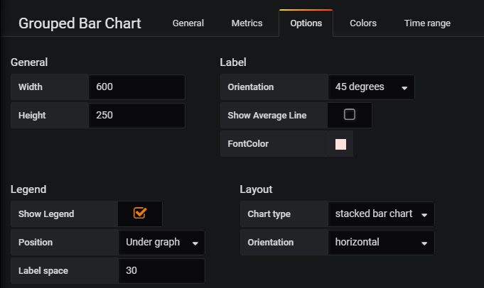

## Grouped Bar Chart Panel Plugin for Grafana

grouped bar chart (stacked or side by side, horizontal or vertical)

## Screenshots
### chart


### metrics

showing information about sub-groups( second column ) of the main categories ( first column )


### options



### colors


## Installation

clone this repository into your plugin directory

```
git clone https://github.com/gipong/grafana-groupedbarchart-panel.git
sudo service grafana-server restart
```

## License
MIT